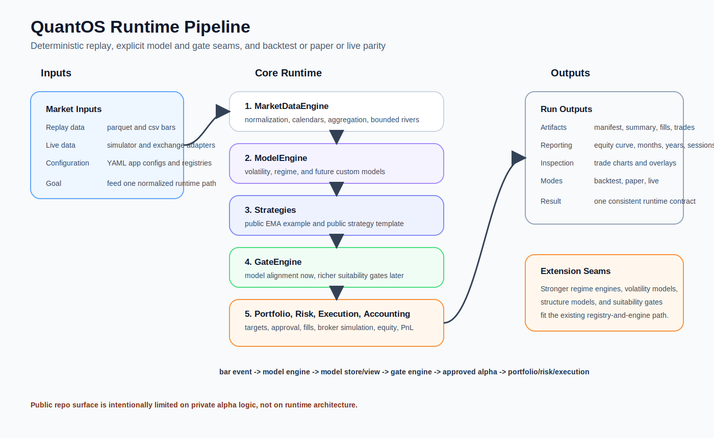

# QuantOS

QuantOS is a kernel-first, event-driven quantitative trading runtime built around deterministic replay, typed domain contracts, and backtest, paper, and live parity.

This public snapshot keeps the core system intact:

- deterministic market-data replay from parquet or csv
- bounded market-data rivers and timeframe aggregation
- typed event dispatch through a synchronous runtime
- strategy, model, gate, portfolio, risk, execution, and accounting layers
- backtest, paper, and live runner entry points
- post-run analytics and trade visualization

What is intentionally not public is the private alpha inventory. The repository exposes one example strategy and one strategy template, while keeping the stronger runtime, execution, and analytics stack visible.



## Why This Repo Is Substantive

QuantOS is not a script that loops over candles and prints PnL. The project is organized as a reusable operating layer for systematic trading research and runtime execution.

Technical characteristics:

- deterministic replay and reproducible run artifacts
- explicit domain contracts for events, orders, fills, positions, and policies
- market-data normalization and aggregation separated from strategy logic
- portfolio targeting separated from risk approval and execution planning
- accounting treated as the source of truth for equity, positions, fees, and PnL
- shared runtime semantics across backtest, paper, and live modes
- integration seams for models, gates, analytics, and visualization

If someone is evaluating the engineering quality of the project, those boundaries matter more than the number of private strategies hidden behind them.

## Public Surface

The public repo intentionally exposes only these strategies:

- `qcore.alpha.strategies.ema_cross.EmaCrossStrategy`
- `qcore.alpha.strategies.strategy_template.StrategyTemplate`

The runtime around those strategies is much broader and includes:

- `apps.backtester.main`
- `apps.paper_trader.main`
- `apps.live_trader.main`
- `apps.trade_visualizer.main`
- `qcore.models.vol.ewma_volatility.EwmaVolatilityModel`
- `qcore.models.regime.ema_regime.EmaTrendRegimeModel`
- `qcore.gates.model_alignment.ModelAlignmentGate`

## Models, Gates, And Extension Seams

This is one of the main reasons the repo is stronger than a simple strategy demo.

QuantOS already ships:

- a model registry at `qcore/registry/models.py`
- a model runtime at `qcore/models/engine.py`
- a model view/store path at `qcore/models/view.py` and `qcore/models/store.py`
- a gate registry at `qcore/registry/gates.py`
- a gate runtime at `qcore/gates/engine.py`

The public snapshot includes a small but real example path:

- volatility model: EWMA realized volatility
- regime model: EMA trend regime
- gate: model-alignment gate with regime and volatility checks

The important point is architectural: richer models fit naturally into this system.

Examples that could be dropped into the same runtime shape:

- a more advanced regime engine
- a volatility state model or vol-surface adapter
- a structure or trend-quality model
- suitability gates that approve or reject strategy signals based on model context

Those extensions do not require rewriting the backtester. They fit the existing composition flow:

```text
bar event -> model engine -> model store/view -> gate engine -> approved alpha -> portfolio/risk/execution
```

That separation is already present in the public codebase.

### Example config path

The shipped public example already demonstrates model-plus-gate composition:

```yaml
models:
  - kind: ewma_vol
    model_id: volatility.ewma
    timeframe: 1d
    lookback: 5
  - kind: ema_regime
    model_id: regime.ema
    timeframe: 1d
    fast_period: 3
    slow_period: 5

gates:
  - kind: model_alignment
    gate_id: gate.model_alignment
    timeframe: 1d
    regime_model_id: regime.ema
    volatility_model_id: volatility.ewma
    require_regime_alignment: true
    max_annualized_vol: 5.0
```

That means the repository is already demonstrating the correct seam for plugging in a stronger regime engine or volatility engine later.

## Architecture At A Glance

The key design choice is that each layer owns a specific responsibility. Strategies do not place broker orders directly. Risk does not live inside alpha code. Accounting is not implicit. That is the difference between a research script and a platform.

## What You Can Do With The Public Repo

### Backtest

Run deterministic backtests from local parquet or csv data using YAML configuration:

```powershell
py -3 -m apps.backtester.main --config configs/app/backtest_ema_cross.yaml --project-root .
```

The backtester writes structured artifacts under `artifacts/runs/<run_id>`, including:

- `manifest.json`
- `summary.json`
- `fills.jsonl`
- `trades.jsonl`
- `ledger.jsonl`
- `equity_curve.csv`
- `equity_curve.png`
- `sessions.csv`

### Paper Runtime

Run the paper trader through the same core runtime:

```powershell
py -3 -m apps.paper_trader.main --config configs/app/paper_ema_cross_simulator.yaml --project-root .
```

The shipped public config uses a scripted simulator feed so the mode is reproducible out of the box.

### Live Runtime

Run the live trader entry point:

```powershell
py -3 -m apps.live_trader.main --config configs/app/live_ema_cross_simulator.yaml --project-root .
```

The public config is simulator-based by default. The live runtime and Binance market-data adapter are still present, but the public repo does not ship private execution routing.

### Trade Visualization

Render trade-centric charts from a completed run:

```powershell
py -3 -m apps.trade_visualizer.main --run-dir artifacts/runs/<run_id> --max-trades 10 --chart-timeframe 1d --ema-stack 3 5
```

The visualizer can overlay EMA stacks and produce an indexed chart set from recorded trades.

## Visualization And Reporting

QuantOS does not stop at signal generation. The public repo also exposes the post-run inspection path:

- `summary.json`
- `equity_curve.csv`
- `equity_curve.png`
- `months.csv`
- `years.csv`
- `sessions.csv`
- trade-level charts through `apps.trade_visualizer.main`

That matters because research infrastructure is only useful if it makes results inspectable. A system that can replay, execute, account, report, and visualize is materially more valuable than one that only emits trades.

## Quick Start

### 1. Create a virtual environment

PowerShell:

```powershell
py -3.12 -m venv .venv
.\.venv\Scripts\Activate.ps1
```

Bash:

```bash
python3.12 -m venv .venv
source .venv/bin/activate
```

### 2. Install

Base install:

```bash
pip install -e .
```

With test dependencies:

```bash
pip install -e ".[dev]"
```

With live-market-data extras:

```bash
pip install -e ".[live]"
```

With visualization extras:

```bash
pip install -e ".[viz]"
```

### 3. Run the shipped backtest

```powershell
py -3 -m apps.backtester.main --config configs/app/backtest_ema_cross.yaml --project-root .
```

### 4. Run the shipped tests

```powershell
py -3 -m pytest
```

## Repository Layout

```text
QuantOS/
|-- adapters/
|   `-- exchanges/
|-- apps/
|   |-- backtester/
|   |-- live_trader/
|   |-- paper_trader/
|   `-- trade_visualizer/
|-- configs/
|   `-- app/
|-- docs/
|-- qcore/
|   |-- accounting/
|   |-- alpha/
|   |-- analytics/
|   |-- data/
|   |-- domain/
|   |-- execution/
|   |-- gates/
|   |-- indicators/
|   |-- kernel/
|   |-- models/
|   |-- portfolio/
|   |-- registry/
|   |-- risk/
|   |-- services/
|   `-- simulation/
|-- scripts/
|-- tests/
|-- pyproject.toml
`-- README.md
```

## Included Models And Gate

The public snapshot includes a small but real model and gate path:

- volatility model: EWMA realized volatility
- regime model: EMA trend regime
- gate: model-alignment gate with volatility cap and regime alignment checks

That means the public example is not just strategy-only. It demonstrates how model outputs can flow into gate decisions before execution.

## Data Expectations

The default public backtest config uses a shipped fixture:

- `tests/fixtures/data/ema_cross_sample_bars.parquet`

For your own data, the parquet adapter expects explicit column mapping in config. The default example uses:

- `timestamp`
- `symbol`
- `venue`
- `timeframe`
- `open`
- `high`
- `low`
- `close`
- `volume`

Timeframe aggregation is handled inside the runtime, not inside strategy code.

## Example Strategy Files

Public strategy example:

- `qcore/alpha/strategies/ema_cross.py`

Public strategy template:

- `qcore/alpha/strategies/strategy_template.py`

The template is the intended starting point for new public strategies. It shows the contract that a strategy must satisfy without exposing private alpha logic.

## Strategy Development Path

The public strategy surface is intentionally small, but it is not shallow.

If you want to add a new strategy cleanly:

1. copy `qcore/alpha/strategies/strategy_template.py`
2. implement `on_bar_close()`
3. register the strategy in `qcore/registry/strategies.py`
4. add a config under `configs/app/`

Because strategies sit on top of normalized market data and feed into the same downstream portfolio, risk, and execution path, the runtime remains stable even as alpha logic changes.

## Testing And Determinism

The public repo ships unit, integration, and determinism coverage under `tests/`.

Representative examples:

- registry and component construction tests
- replay and aggregation tests
- accounting and execution tests
- backtester smoke tests
- paper and live runtime smoke tests
- deterministic backtest regression checks

This is an important part of the project. Quant infrastructure that cannot be tested deterministically is not credible.

## What Is Intentionally Not Included

- private strategy packs
- proprietary research logic
- trained or serialized model artifacts
- local run results
- internal workflow metadata
- exchange order-routing infrastructure

The public repo is meant to show the architecture and engineering quality of the system without disclosing private trading logic.

## Suggested Entry Points

If you want to inspect the system quickly, start here:

- backtest CLI: `apps/backtester/main.py`
- runtime builder: `qcore/services/app_builder/backtest.py`
- replay runner: `qcore/simulation/backtest/runner.py`
- market data engine: `qcore/data/engine.py`
- accounting engine: `qcore/accounting/portfolio_state/engine.py`
- strategy registry: `qcore/registry/strategies.py`
- example alpha: `qcore/alpha/strategies/ema_cross.py`
- visualization CLI: `apps/trade_visualizer/main.py`

## Bottom Line

QuantOS is a public systems repo, not a strategy dump. The strength of the project is the runtime architecture: deterministic replay, explicit contracts, separated layers, testing, analytics, and consistent execution semantics across modes.

That is the part worth evaluating.
